# petty: set

An open-source, local-first browser editor for visual shot planning and 3D previsualization. This project is part of the Petty FOSS family. It is an independent implementation inspired by film planning tools, including Lensflare, Open Shot Designer, and Blocking Room. It does not use their code, branding, or assets.

## Run locally

```sh
npm install
npm run dev
```

Open the address printed by Vite. Films, model files, reference images, floor-plan images, and captured frames are saved in this browser's IndexedDB; an existing single-film local save is migrated automatically and retained as a recovery copy. Export project files regularly for backups you can move to another browser or computer.

## Preview

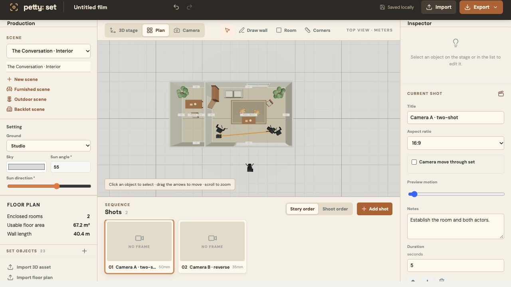

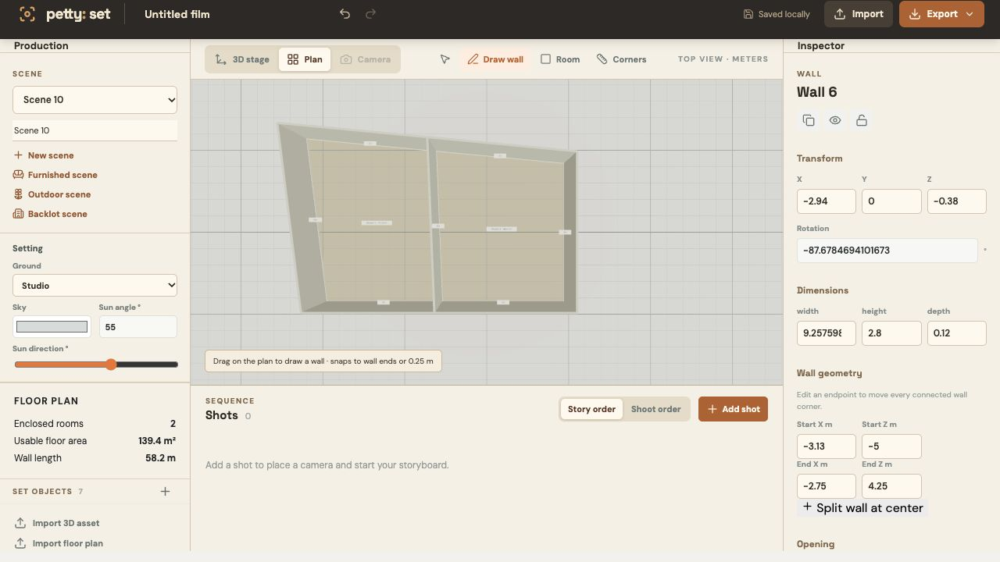

[Open the editable sample floor plan SVG](docs/examples/furnished-floor-plan.svg)

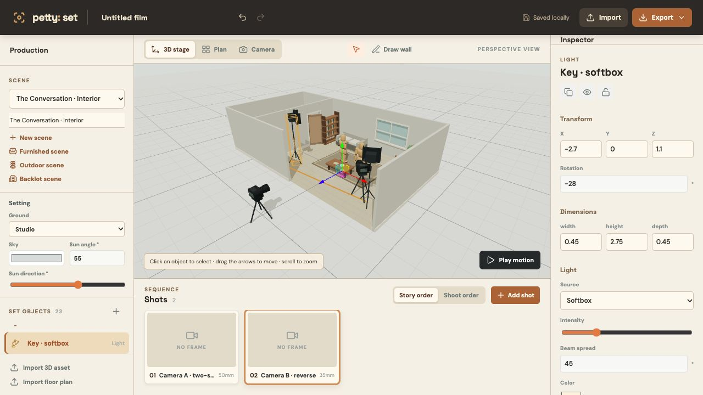

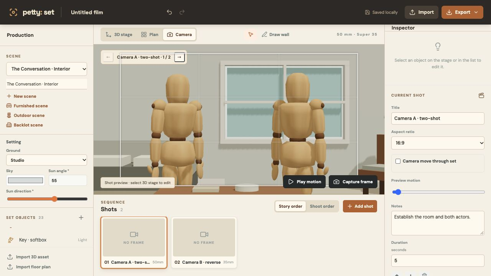

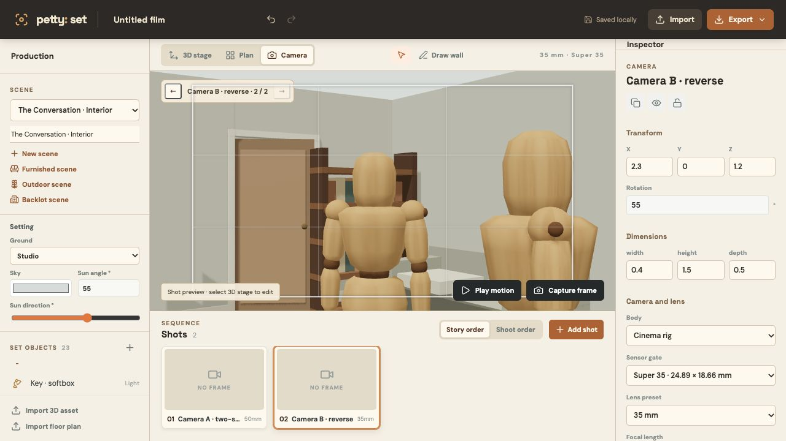

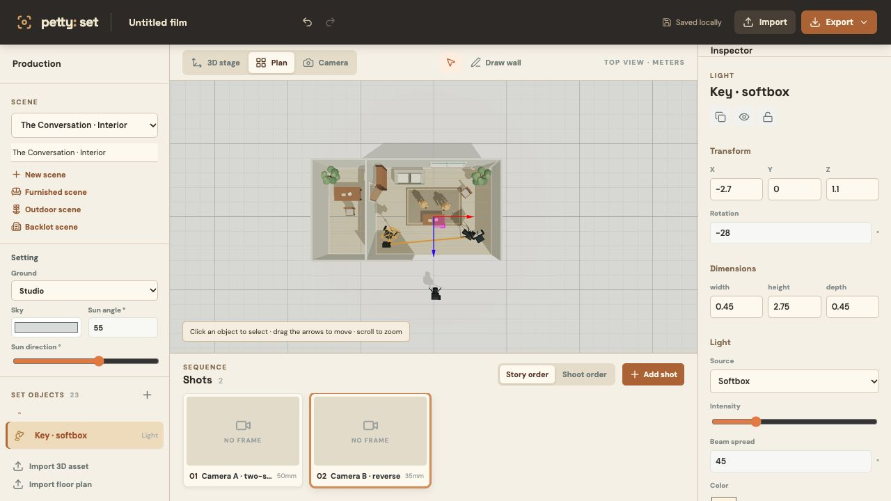

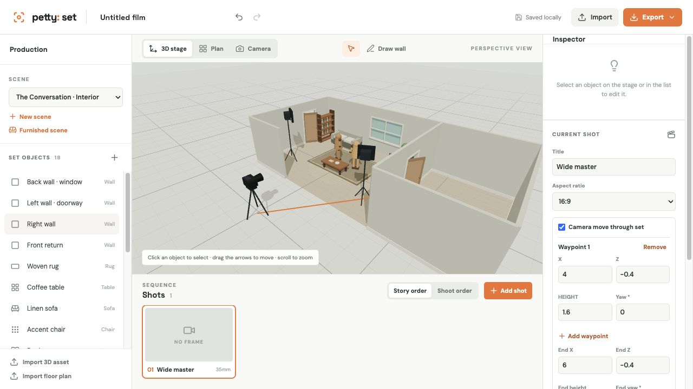

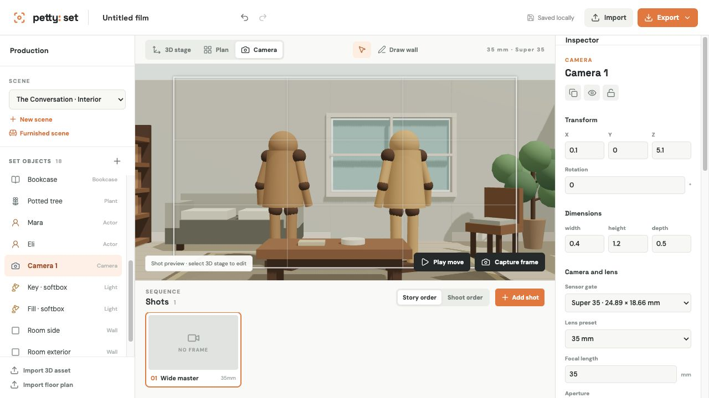

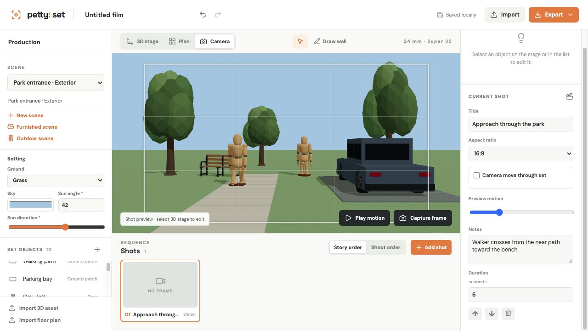

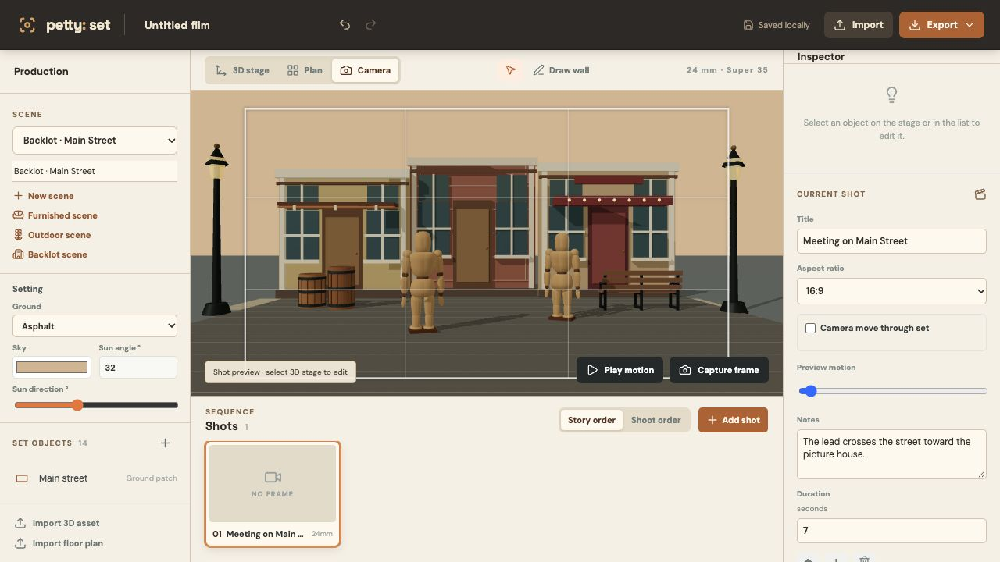

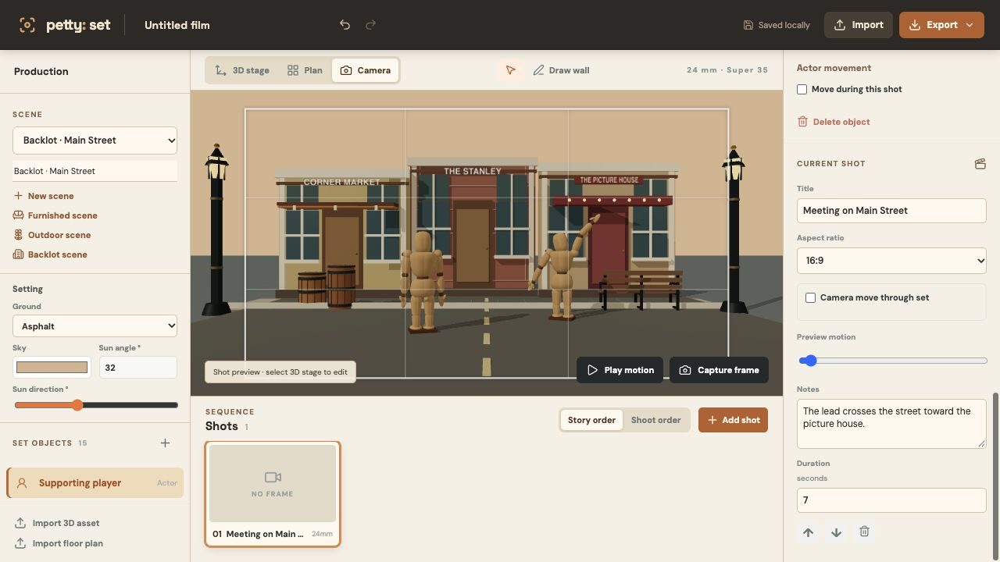

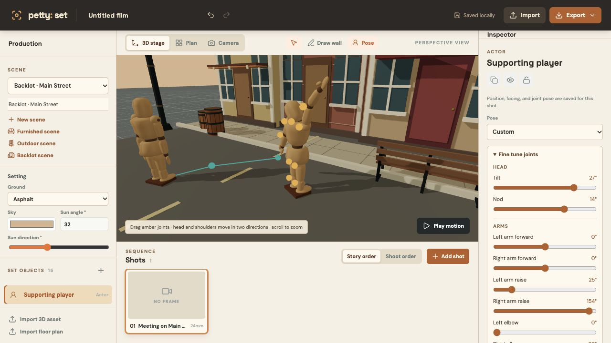

## Current features

- A local film library with separate autosave, create, switch, rename, delete, and portable import/export for each film. Each film has multiple scenes with separate editable 3D sets.
- Draw walls on a quarter-meter grid with endpoint and edge snapping, drag out rectangular rooms, move shared corners, split walls, and add framed doorways and windows. Interior partitions split wall intersections and divide measured rooms. Closed outlines form individual 3D floors; plan view labels wall lengths and room areas. Position blocks, tables, chairs, sofas, bookcases, plants, rugs, wooden drawing mannequins with visible joints and neutral, greeting, or pointing poses, camera tripods, and softbox lights. Edit dimensions, rotation, camera focal length, and light intensity, spread, and color.
- Add a furnished sample scene with connected rooms, two camera setups, actor actions, and a lighting power source without replacing the current scene. All sample objects remain editable.
- Build an outdoor scene with grass, asphalt, sand, or studio ground; set sky color and sun direction/elevation; add original trees, park benches, vehicles, and paved ground patches. An exterior sample scene demonstrates the catalog.
- Dress a stylized backlot street with editable storefront, brick, and theater facades, custom sign text, detailed streetlamps and barrels, road markings, scored sidewalks, curbs, and wooden actors. The Main Street sample includes an actor route, a greeting pose, and a camera shot. The editor uses a warm studio palette inspired by classic movie-making games; all scene geometry and styling are original.
- Extend a selected wall into an adjoining room with a doorway, then furnish that room and route a camera move through it with editable waypoints.
- Import self-contained glTF 2.0 `.glb` assets up to 50 MB. Model bytes stay in local IndexedDB storage; exported project JSON embeds them for portable backups.
- Store storyboard references, imported floor-plan images, and captured frames outside the film record while keeping project backups self-contained.
- Switch lights between softbox, spotlight, and practical bulb previews. Set actor wood finish and choose a cinema, mirrorless, or broadcast camera body with sensor and lens presets.
- Place a power distribution source, assign lights to it, set fixture loads and source capacity, and see cable runs and total load in the set plan.
- Create shot-specific Plan A/B lighting alternatives, duplicate and rename plans, and preview each plan without changing the shared set or other shots.
- Undo and redo project edits; duplicate, hide, and lock set objects.
- Set actor positions, facing, and twelve mannequin joint angles per shot, then add an end mark and waypoints for each actor. Start from neutral, greeting, or pointing and fine tune the head, shoulders, elbows, hips, and knees with inspector sliders or by dragging amber joint handles in the 3D stage. Preview actor movement with the shot timeline in stage, plan, or camera view; the mannequin shows a simple walk swing during playback.
- Search a small library of original procedural actor actions, assign an action per shot, and control its loop and speed. Actions can play while actors hold their marks.
- Import an image floor plan as a set reference; set its width, height, position, rotation, and opacity, or calibrate its scale by clicking two points with a known real-world distance.
- Switch between orbiting 3D stage, top plan, and camera view.
- Add shots with separate cameras; choose a sensor gate, focal length, aperture, focus distance, and shot aspect ratio. The camera view shows framing guides and approximate depth-of-field limits, with controls to switch directly between camera setups.
- Export a clean camera still at 1280, 1920, or 2560 pixels wide using the shot's saved aspect ratio and lens field of view.
- Arrange story and shoot order independently and export a shot-list CSV in either order.
- Capture camera frames into the storyboard; edit shot notes and duration.
- Export editable JSON, measured floor plan SVG, view PNG, and storyboard PDF.
- Export current-shot and batch shoot-day PDF sheets, current-shot PNG and batch PNG ZIP sheets, a paginated shot-list PDF, and a fixture/power schedule PDF.

## Parity roadmap

See the [feature gap matrix](docs/FEATURE_GAP.md) for a detailed comparison and build order.

The [parity plan](docs/PARITY_PLAN.md) defines the implementation phases and acceptance gates.

This is an early editor, not yet a feature-complete Lensflare equivalent. The next work should add:

1. Modeling tools: richer material controls, tracing over imported floor plans, rotation and grouping tools, and a larger original asset catalog.
2. Cinematography: visual depth of field, curved camera paths, collision-aware movement, and take variants.
3. Performance planning: inverse kinematics, rigged animation assets, route collision checks, more lighting modifiers and editable cable routes.
4. Production outputs: richer board layouts and more print layout options.
5. Collaboration: optional project accounts, shareable review links, comments, crew roles, editing, and branding.

## References

- [Lensflare](https://lensflare.io/) — product and workflow reference.
- [Open Shot Designer](https://github.com/koosoli/OpenShotDesigner) — GPLv3 production planning reference.
- [Blocking Room](https://github.com/mangerik/Blocking-Room) — MIT 3D blocking reference.
- [The Movies manual](https://cdn.steamstatic.com/steam/apps/7900/manuals/manual_english.pdf?t=1447351040) — set dressing, actor placement, weather, and lighting workflow reference.

## License

AGPL-3.0-or-later, matching the other Petty FOSS projects. See [LICENSE](LICENSE).
